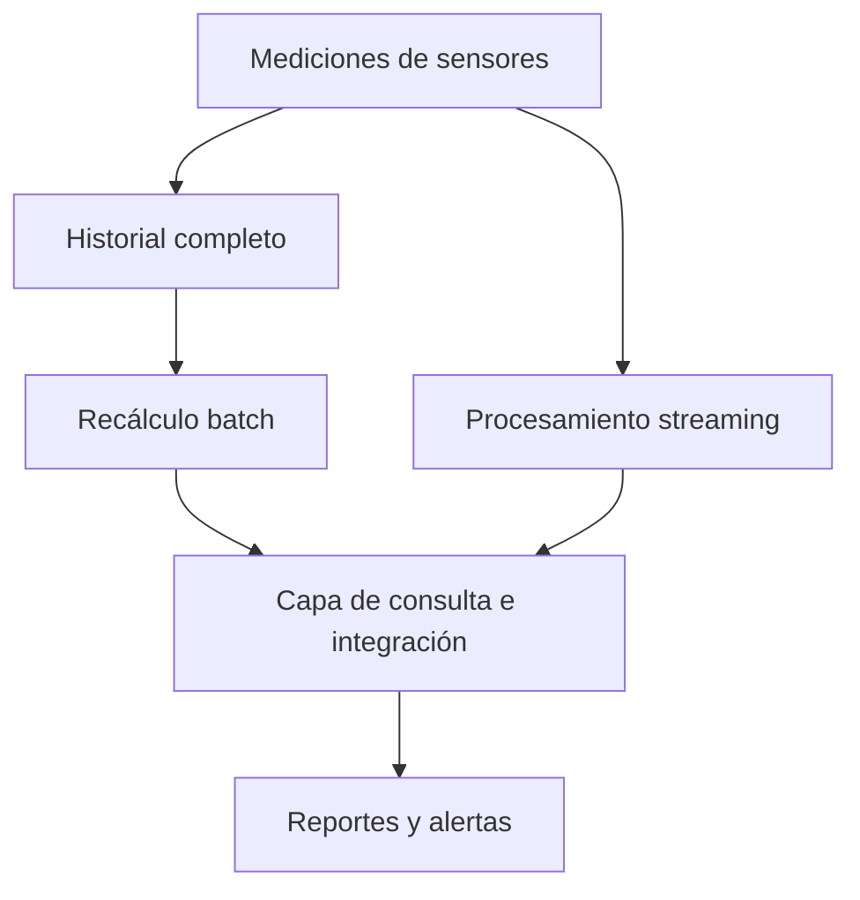
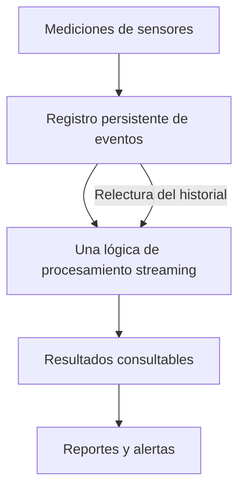

# Informe: análisis de sensores industriales

**Nombre:** Diego Alfonso Trejo Arellano  
**Grupo:** __________________  
**Fecha:** 5 de octubre de 2026

## 5. Las 5 V aplicadas al proyecto

| V | Relación con el sistema | Ejemplo concreto | ¿Actual o futuro? |
|---|---|---|---|
| Volumen | Es la cantidad de datos que se almacenan y analizan. | El CSV tiene 100,000 mediciones y 40 sensores. Con miles de sensores el historial crecería mucho más. | Las 100,000 mediciones son actuales; el aumento es futuro. |
| Velocidad | Es la frecuencia con la que llegan los datos y el tiempo disponible para procesarlos. | Actualmente las lecturas son por minuto. En una ampliación hipotética con 5,000 sensores y una lectura por segundo serían 5,000 lecturas por segundo y 432,000,000 al día. | La frecuencia por minuto corresponde al ejercicio actual; 5,000 sensores es un ejemplo futuro, no un dato del CSV. |
| Variedad | Son los distintos formatos y fuentes de información. | Hoy hay una tabla CSV. En el futuro podrían recibirse mensajes JSON, fotografías de máquinas y reportes de mantenimiento. | CSV actual; JSON, fotografías y reportes corresponden a la ampliación propuesta. |
| Veracidad | Es la calidad y confiabilidad de los datos. | Revisé campos vacíos e identificadores: encontré 0 filas con campos vacíos y 100,000 identificadores de registro distintos. En un sistema real también revisaría calibración, duplicados y lecturas fuera de rango. | La revisión básica se hizo en el CSV actual; los problemas de calibración son riesgos futuros, no fallas comprobadas en este archivo. |
| Valor | Es la utilidad que se obtiene del análisis para tomar decisiones. | Detecté 6,954 alertas y que Planta_3 concentra 1,777. Esto permite priorizar una revisión, sin afirmar que las máquinas tengan una falla. | Resultado del CSV actual. |

Que los datos estén completos no garantiza que representen correctamente la realidad. Son datos simulados y el CSV no incluye calibración, fotografías ni fallas confirmadas.

## 6. Tipos de datos y procesamiento tradicional

| Elemento | Clasificación | Motivo |
|---|---|---|
| CSV de sensores | Estructurados | Se organiza en filas y columnas con los mismos campos. |
| Mensaje JSON de un sensor | Semiestructurados | Tiene claves y valores, pero puede admitir campos opcionales y estructuras anidadas. |
| Fotografía de una máquina | No estructurados | El contenido visual no es una tabla de atributos directamente consultable. |
| Texto libre de mantenimiento | No estructurados | La redacción puede variar y requiere interpretar el contenido. |

Tener 100,000 registros no convierte automáticamente un archivo en Big Data. También importan el tamaño en bytes, la velocidad de llegada, la variedad y los recursos necesarios. Este archivo original ocupa 4,618,766 bytes, aproximadamente 4.62 MB, y se puede procesar en una computadora con Python.

Al crecer a miles de sensores por segundo, una sola computadora podría quedarse corta en memoria, almacenamiento, entrada/salida y capacidad de procesamiento. Mi programa recorre el CSV una vez, pero conserva las alertas y los empates del máximo en memoria, así que también tiene límites. Para una escala mayor consideraría almacenamiento distribuido, particiones por fecha y planta, procesamiento de eventos y políticas de conservación. Las fotografías incrementarían el almacenamiento y necesitarían otro tipo de análisis.

## 7. Batch y Streaming

El programa usa **batch**, porque analiza un archivo que ya está guardado y entrega resultados al terminar de recorrerlo. No está conectado a un flujo de sensores.

Para emitir una alerta pocos segundos después de una lectura mayor que 85 °C usaría **streaming**: cada evento se recibe, se valida y se compara con el umbral. Así la empresa obtiene una respuesta de baja latencia sin esperar a completar el día. También habría que gestionar eventos duplicados, retrasos y desconexiones.

Para un resumen al terminar el día usaría **batch** sobre las lecturas de ese día: promedios, máximos y cantidad de alertas por planta. Aquí se puede esperar hasta el cierre. Definiría la zona horaria y cómo incorporar lecturas que lleguen tarde. Aunque streaming también puede mantener agregados diarios, batch es suficiente para ese plazo.

## 8. Lambda y Kappa

### Escenario A: arquitectura Lambda

Elegiría Lambda porque el escenario requiere dos rutas: una que recalcule el historial por lotes y otra que procese rápidamente lo reciente. Los resultados se integran en una capa de consulta. La dificultad es mantener consistentes las dos lógicas y evitar contar dos veces las mismas lecturas cuando el batch se actualiza.

### Escenario B: arquitectura Kappa

Elegiría Kappa porque se busca una sola lógica de procesamiento de eventos. Guardaría las mediciones en un registro persistente que permita reproducirlas. Si cambio una regla o necesito reconstruir resultados, volvería a pasar los eventos guardados por esa misma lógica, sin crear una segunda ruta batch independiente. La retención debe cubrir el historial que se quiera reprocesar y las salidas deben evitar duplicados durante la reconstrucción.

## 9. Analítica descriptiva, predictiva y prescriptiva

### Descriptiva: ¿qué muestran los datos?

**Hallazgo 1.** De 100,000 lecturas, 6,954 superaron 85 °C: el **6.954 %**. La mayor cantidad corresponde a **Planta_3, con 1,777 alertas**. Como cada planta tiene 25,000 registros, su proporción es 7.108 %.

| Planta | Temperatura promedio (°C) | Alertas > 85 °C |
|---|---:|---:|
| Planta_1 | 66.6163 | 1,737 |
| Planta_2 | 66.5350 | 1,708 |
| Planta_3 | 66.7658 | 1,777 |
| Planta_4 | 66.6690 | 1,732 |

**Hallazgo 2.** La temperatura máxima fue **104.99 °C**, con cuatro registros empatados:

| Registro | Sensor | Fecha y hora (día/mes/año) | Planta |
|---|---|---|---|
| 53743 | S023 | 01/09/2026 22:23 | Planta_3 |
| 89259 | S019 | 02/09/2026 13:11 | Planta_2 |
| 94534 | S014 | 02/09/2026 15:23 | Planta_2 |
| 96110 | S030 | 02/09/2026 16:02 | Planta_3 |

### Predictiva: ¿qué podría pasar?

Mi pregunta sería: **¿qué máquinas tienen mayor probabilidad de presentar una falla en las próximas 24 horas, considerando sus tendencias de temperatura y vibración?**

Para investigarla necesitaría un historial más largo, fallas confirmadas con fecha y tipo, la relación entre sensores y máquinas, mantenimiento realizado, carga de trabajo, antigüedad, tipo de equipo, condiciones ambientales y calibración. También necesitaría intervalos sin falla para comparar. El CSV no incluye esas etiquetas ni permite comprobar por sí solo una predicción de fallas. Evaluaría cualquier modelo con datos posteriores en el tiempo a los usados para entrenarlo.

### Prescriptiva: ¿qué acción conviene tomar?

Si un modelo validado anticipara un riesgo elevado, propondría una inspección prioritaria y, según el diagnóstico, programar mantenimiento en una ventana de baja producción. Antes de decidir revisaría la confiabilidad de la predicción, la persistencia de las lecturas, la calibración, los límites del fabricante, el historial de la máquina, su importancia para la operación, la disponibilidad de técnicos y refacciones, y los costos de intervenir o esperar.

El umbral de **85 °C es una regla didáctica**. Superarlo genera una alerta del ejercicio; por sí solo no demuestra una falla futura ni justifica detener automáticamente una máquina.
