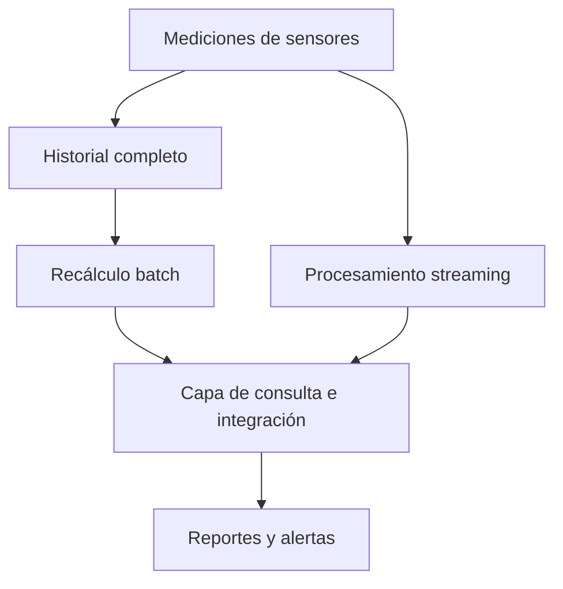
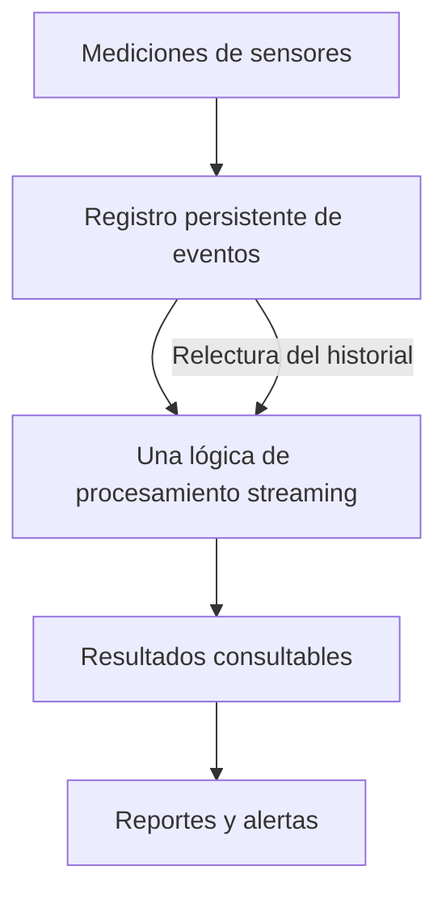

# Informe: análisis de sensores industriales

**Nombre:** Diego Alfonso Trejo Arellano  
**Grupo:** IDIA 224  
**Fecha:** 5 de octubre de 2026

## 5. Las 5 V aplicadas al proyecto

| V | Relación con el sistema | Ejemplo concreto | ¿Actual o futuro? |
|---|---|---|---|
| Volumen | Es la cantidad de datos que se almacenan y analizan. | El CSV tiene 100,000 mediciones y 40 sensores. Con miles de sensores el historial crecería mucho más. | Las 100,000 mediciones son actuales; el aumento es futuro. |
| Velocidad | Es la frecuencia con la que llegan los datos y el tiempo disponible para procesarlos. | Actualmente las lecturas son por minuto. En una ampliación hipotética con 5,000 sensores y una lectura por segundo serían 5,000 lecturas por segundo y 432,000,000 al día. | La frecuencia por minuto corresponde al ejercicio actual; 5,000 sensores es un ejemplo futuro, no un dato del CSV. |
| Variedad | Son los distintos formatos y fuentes de información. | Hoy hay una tabla CSV. En el futuro podrían recibirse mensajes JSON, fotografías de máquinas y reportes de mantenimiento. | CSV actual; JSON, fotografías y reportes corresponden a la ampliación propuesta. |
| Veracidad | Es la calidad y confiabilidad de los datos. | El archivo no tiene campos vacíos y sus 100,000 identificadores de registro son distintos. En un sistema real también habría que revisar la calibración de los sensores. | La revisión básica se hizo en el CSV actual; los problemas de calibración son riesgos futuros, no fallas comprobadas en este archivo. |
| Valor | Es la utilidad que se obtiene del análisis para tomar decisiones. | Hay 6,954 alertas, de las cuales 1,777 son de Planta_3. Este resultado sirve para decidir dónde empezar una revisión. | Resultado del CSV actual. |

Que los datos estén completos no garantiza que representen correctamente la realidad. Son datos simulados y el CSV no incluye calibración, fotografías ni fallas confirmadas.

## 6. Tipos de datos y procesamiento tradicional

| Elemento | Clasificación | Motivo |
|---|---|---|
| CSV de sensores | Estructurados | Se organiza en filas y columnas con los mismos campos. |
| Mensaje JSON de un sensor | Semiestructurados | Tiene claves y valores, pero puede admitir campos opcionales y estructuras anidadas. |
| Fotografía de una máquina | No estructurados | La imagen necesita interpretarse; su contenido no está organizado en filas y columnas. |
| Texto libre de mantenimiento | No estructurados | La redacción puede variar y requiere interpretar el contenido. |

Tener 100,000 registros no convierte automáticamente un archivo en Big Data. También importan el tamaño en bytes, la velocidad de llegada, la variedad y los recursos necesarios. Este archivo original ocupa 4,618,766 bytes, aproximadamente 4.62 MB, y se puede procesar en una computadora con Python.

Con miles de sensores enviando datos cada segundo, el problema sería guardar y procesar toda esa información a tiempo. Podrían faltar memoria, espacio y capacidad de procesamiento. El programa también tiene un límite, ya que guarda las alertas en memoria. A mayor escala se podría repartir el trabajo entre varios equipos y organizar los datos por fecha y planta. Las fotografías ocuparían más espacio y necesitarían un análisis diferente.

## 7. Batch y Streaming

El análisis es **batch**: el programa lee un archivo que ya está guardado y entrega los resultados al terminar.

Para avisar pocos segundos después de recibir una temperatura mayor que 85 °C, usaría **streaming**. Cada lectura se revisa conforme llega y, si supera el límite, se genera la alerta. También habría que controlar las lecturas repetidas y las que lleguen con retraso.

Para el resumen diario usaría **batch**, calculando los promedios, máximos y alertas de cada planta al cierre del día. Este resultado puede esperar; una alerta inmediata no. Habría que fijar el horario de cierre y decidir cómo incluir las lecturas que lleguen tarde.

## 8. Lambda y Kappa

### Escenario A: arquitectura Lambda

En el escenario A corresponde **Lambda**. Una ruta procesa el historial por lotes y la otra revisa las lecturas recientes en streaming. Después se juntan los resultados para consultarlos. Hay que cuidar que ambas rutas apliquen las mismas reglas y que una lectura no se cuente dos veces.

### Escenario B: arquitectura Kappa

En el escenario B corresponde **Kappa**. Las lecturas pasan por una sola lógica de procesamiento y quedan guardadas en un registro de eventos. Si cambia una regla, los datos anteriores se pueden volver a procesar con esa misma lógica. Para hacerlo, es necesario conservar el historial y evitar duplicar los resultados al repetir el proceso.

## 9. Analítica descriptiva, predictiva y prescriptiva

### Descriptiva: ¿qué muestran los datos?

**Hallazgo 1.** De 100,000 lecturas, 6,954 superaron 85 °C: el **6.954 %**. La mayor cantidad corresponde a **Planta_3, con 1,777 alertas**. Como cada planta tiene 25,000 registros, su proporción es 7.108 %.

| Planta | Temperatura promedio (°C) | Alertas > 85 °C |
|---|---:|---:|
| Planta_1 | 66.6163 | 1,737 |
| Planta_2 | 66.5350 | 1,708 |
| Planta_3 | 66.7658 | 1,777 |
| Planta_4 | 66.6690 | 1,732 |

**Hallazgo 2.** La temperatura máxima fue **104.99 °C**, con cuatro registros empatados:

| Registro | Sensor | Fecha y hora (día/mes/año) | Planta |
|---|---|---|---|
| 53743 | S023 | 01/09/2026 22:23 | Planta_3 |
| 89259 | S019 | 02/09/2026 13:11 | Planta_2 |
| 94534 | S014 | 02/09/2026 15:23 | Planta_2 |
| 96110 | S030 | 02/09/2026 16:02 | Planta_3 |

### Predictiva: ¿qué podría pasar?

La pregunta sería: **¿qué máquinas tienen mayor probabilidad de presentar una falla en las próximas 24 horas, considerando sus tendencias de temperatura y vibración?**

Se necesitaría un historial más largo que indique cuándo falló cada máquina, qué sensor le corresponde y qué mantenimiento recibió. También ayudaría conocer su antigüedad, carga de trabajo y condiciones de operación. Habría que comparar periodos con y sin fallas. El CSV actual no incluye esa información, así que no basta para comprobar una predicción. El modelo se probaría con datos posteriores a los usados para entrenarlo.

### Prescriptiva: ¿qué acción conviene tomar?

Si un modelo ya probado indicara un riesgo alto, la empresa podría revisar primero esa máquina y programar mantenimiento en un horario de menor producción. Antes de decidir, convendría comprobar si las temperaturas altas se repiten, si el sensor está bien calibrado y cuáles son los límites del fabricante. También importan el historial de mantenimiento, la confiabilidad de la predicción, el costo de detener la máquina y la disponibilidad de técnicos y refacciones.

El umbral de **85 °C es una regla didáctica**. Superarlo genera una alerta del ejercicio; por sí solo no demuestra una falla futura ni justifica detener automáticamente una máquina.
